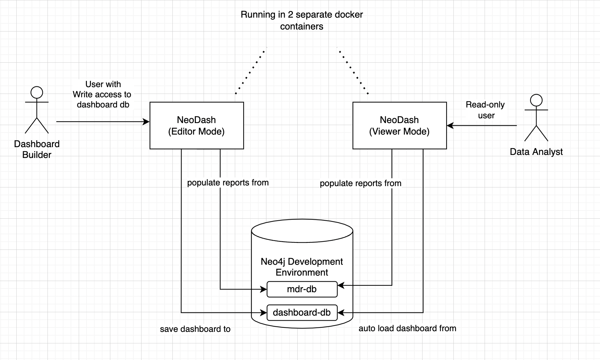
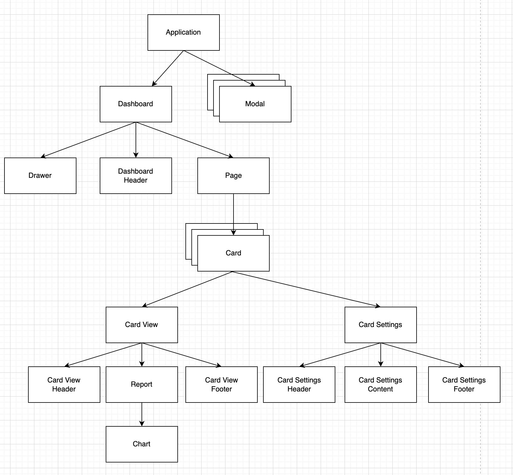

## NeoDash - Neo4j Dashboard Builder
NeoDash is an open source tool for visualizing your Neo4j data. It lets you group visualizations together as dashboards, and allow for interactions between reports. 


Neodash supports presenting your data as tables, graphs, bar charts, line charts, maps and more. It contains a Cypher editor to directly write the Cypher queries that populate the reports. You can save dashboards to your database, and share them with others.

## Running NeoDash
There are three ways to run the application:

1. You can install NeoDash into Neo4j Desktop from the [graph app gallery](https://install.graphapp.io). NeoDash will automatically connect to your active database.
2. You can run NeoDash from a web browser by visiting http://neodash.graphapp.io.
3. For offline deployments, you can build the application yourself. See the developer guide below.


# Developer Guide
## Run locally with Docker
Pull the latest image from Docker Hub to run the application locally:
```
# Run the application on http://localhost:5005
docker pull nielsdejong/neodash:latest
docker run -it --rm -p 5005:5005 nielsdejong/neodash
```

> Windows users may need to prefix the `docker run` command with `winpty`.


## Run & Build using npm
NeoDash is built with React. You'll need `npm` installed to run the web app.

> Use a recent version of `npm` and `node` to build NeoDash. The application has been tested with npm 8.6 & node v17.4.0.

To run the application in development mode:
- clone this repository.
- open a terminal and navigate to the directory you just cloned.
- execute `npm install` to install the necessary dependencies.
- execute `npm run dev` to run the app in development mode.
- the application should be available at http://localhost:3000.


To build the app for production:
- follow the steps above to clone the repository and install dependencies.
- execute `npm run build`. This will create a `build` folder in your project directory.
- deploy the contents of the build folder to a web server. You should then be able to run the web app.


## Build Docker image
A pre-built Docker image is available [on DockerHub](https://hub.docker.com/r/nielsdejong/neodash). 
This image is built using the default configuration (running in editor mode, without SSO).

### To build the image yourself:

Make sure you have a recent version of `docker` installed to build the multi-stage NeoDash image and run it.

On Unix (Mac/Linux) systems:
```
docker build . -t neodash
```

If you use Windows, you might need to prefix the command with `winpty`:
```
winpty docker build . -t neodash
```

After building, you can run the image with:
```
docker run  -it --rm -p 5005:5005 neodash
```

## Run in standalone mode
NeoDash can be deployed in a 'standalone mode' for dashboard viewers. This mode will:
- Disable all editing options
- Have a hardcoded Neo4j URL and database name
- Load a dashboard from Neo4j with a fixed name.

The diagram below illustrates how NeoDash standalone mode can be deployed next to a standard 'Editor Mode' instance:



### Option 1 - Standard Deployment (Non-Docker)
First, build NeoDash as described above. Then, you'll have a `dist` directory that you can deploy to a web server.

To configure the app to run in standalone mode, you'll need to edit `dist/config.json` and change the `standalone` property to `true`.
The other variables inside `config.json` should also be configured to match the hostname, port and database name of your Neo4j instance.

As `config.json` gets picked up at runtime by the application, users viewing the application will now access the dashboard in standalone mode. 

### Option 2 - Docker Deployment
You can configure the app to run in standalone by passing environment variables to Docker:
```
docker run  -it --rm -p 5005:5005 \
    -e ssoEnabled=false \
    -e ssoDiscoveryUrl="https://example.com" \
    -e standalone=true \
    -e standaloneProtocol="neo4j" \
    -e standaloneHost="localhost" \
    -e standalonePort="7687" \
    -e standaloneDatabase="neo4j" \
    -e standaloneDashboardName="My Dashboard" \
    -e standaloneDashboardDatabase="dashboards" \
    nielsdejong/neodash
```


> Alternatively, environment variables from docker compose or a kubernetes deployment can also be used.


## Auth Provider (SSO)

To set up NeoDash to use an external identiy provider, you can add a /auth_provider resource to nginx (in `/conf/default.conf`):

```
location /auth_provider {
        default_type application/json;
        return 200 '{
                        "auth_config" : {
                            "oidc_providers" : [ ... ]
                        }
                    }';
    }
```

For basic deployments it might suffice to route requests to `/auth_provider` on the https port of the neo4j database.

## Extending NeoDash
There are two categories of extensions to NeoDash you can build:
- Core Dashboard Functionality
- Custom Reports

The first will require some knowledge about React, Redux, and app internals. Some advanced level knowledge is therefore highly recommended. The second is much simpler, and you should be able to plug in your own visualizations with minimal JS knowledge.

### Core Dashboard Functionality
To extend the core functionality of the app, it helps to be familiar with the following concepts:
- ReactJS
- Redux (State management for React)
- Redux Selectors
- Redux Thunks

The image below contains a high-level overview of the component hierarchy within the application. The following conceptual building blocks are used to create the interface:
- **The Application** - highest level in the component structure. Handles all application-level logic (e.g. initalizing the app).
- **Modals** - all pop-up windows used by the tool. (Connection modal, save-dashboard modal, errors/warnings, etc.) 
- **Drawer** - the sidebar on the left side of the screen. Contains buttons to perform application-level actions. 
- **The Dashboard** - Main dashboard component. Renders components dynamically based on the current state.
- **Dashboard Header** - the textbox at the top of the screen that lets you set a title for the dashboard, plus the page selector.
- **Pages** - a dashboard has one or more pages, each of which can have a list of cards.
- **Cards** - a 'block' inside a dashboard. Each card contains a 'view' window, and a 'settings' window.
- **Card View** - the front of the card containing the selected report.
- **Card Settings** - the back of the card, containing the cypher editor and advanced settings for the report.
- **Card View Header** - the header of the card, containing a text box that acts as the name of the report.
- **Report** - the component inside the card view that handles query execution and result parsing. Contains a single chart (visualization)
- **Card View Footer** - The footer of the card view. Depending on the type, contains several 'selectors' that modify the visualization.
- **Card Settings Header** - Header of the card settings, used for moving/deleting the card.
- **Card Settings Content** - the component containing the main content of the report. This is most often the Cypher query editor.
- **Card Settings Footer** - the 'footer' of the card. This contains the 'advanced settings' window for reports.
- **Charts** - the different visualizations used by the application: bar charts, tables, graphs, etc.



 ### Custom Reports
 As of v2.0, NeoDash is easy to extend with your own visualizations. There are two steps to take to plug in your own charts:
 
####  1. Create the React component
All NeoDash charts implement the interface defined in `src/charts/Chart.tsx`. A custom chart must do the same. the following parameter as passed to your chart from the application:
- `records`: a list of Neo4j Records. This is the raw data returned from the Neo4j driver. 
- `settings`: a dictionary of settings as defined under "advanced report settings" for each report. You can use these values to customize your visualization based on user input.
- `selection`: a dictionary with the selection made in the report footer.
- `dimensions`: an array with the dimensions of the report (mostly not needed, charts automatically fill up space).
- `queryCallback`: a way for the report to read more data from Neo4j, on interactions.
- `setGlobalParameter`: a way for the report to set globally available Cypher parameters, on interactions.

Make sure that your component renders a React component. your component will be automatically scaled to the size of the report. See the other charts in `src/charts/` for examples. 

#### 2. Extend the config to make your component selectable

To let users choose your visualization, you must add it to the app's report configuration. This config is located in `src/config/ReportConfig.tsx`, and defined by the dictionary `REPORT_TYPES`.

To add your visualization to the config, add a new key to the `REPORT_TYPES` dictionary with a unique name. The entry's value is an object which can contain the following fields:
- `label`: a display name for the visualization. Mandatory.
- `component`: the React component that renders the visualization. Mandatory.
- `helperText`: a string that is show under the query box in the report settings. Mandatory.
- `selection`: a list that contains each of the selection boxes present in the report footer. Optional.
- `settings`: a list of selection boxes that shows under the advanced settings. Optional.
- `maxRecords`: a hard limit on the number of records the visualization can handle. Mandatory.
- `useRecordMapper`: whether to use the in-built record mapper to fix your results in a specific format. Optional.
- `useNodePropsAsFields`: whether to use the node property selector as a report footer override. Optional.

If all works, please consider contributing your code to this repository.

## Questions / Suggestions
If you have any questions about NeoDash, please reach out. For feature requests, consider opening an issue on GitHub.

