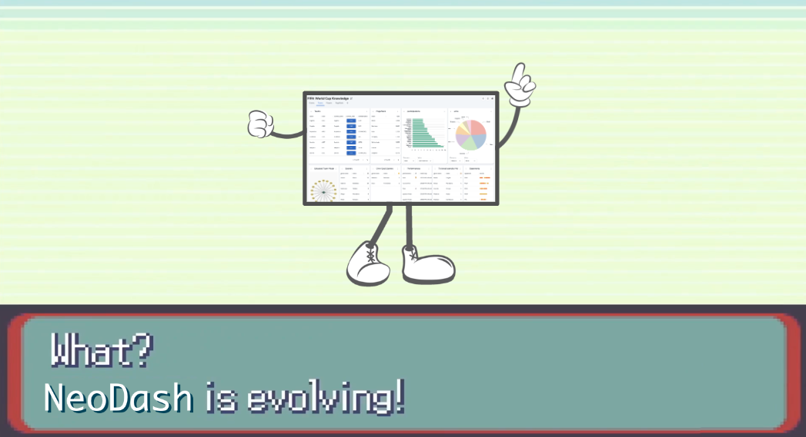

## NeoDash Labs - Neo4j Dashboard Builder



In September 2024 **Neo4j [announced](https://www.datanami.com/2024/09/04/neo4j-simplifies-graph-database-in-the-cloud/#:~:text=NeoDash%20is%20an%20open%20source,was%20open%20source%2C%20not%20supported) NeoDash is evolving into a fully supported dashboard builder, as part of the Neo4j product suite**. 

This project (NeoDash Labs) will still be available and contain experimental features, but will **not** have official support. If you're interested to get official support for NeoDash as part of a Neo4j License agreement, please reach out to your Neo4j contact person.

## About NeoDash Labs
NeoDash is a web-based tool for visualizing your Neo4j data. It lets you group visualizations together as dashboards, and allow for interactions between reports.

Neodash supports presenting your data as tables, graphs, bar charts, line charts, maps and more. It contains a Cypher editor to directly write the Cypher queries that populate the reports. You can save dashboards to your database, and share them with others.

## Try NeoDash Labs
You can run NeoDash in one of three ways:

1. You can install NeoDash Labs into Neo4j Desktop from the [graph app gallery](https://install.graphapp.io). NeoDash will automatically connect to your active database.
> Note: never versions of Neo4j Desktop do not support adding experimental graph apps such as NeoDash.

2. You can run NeoDash Labs from a web browser by visiting http://neodash.graphapp.io.
3. For on-prem deployments, you can build the application yourself, or pull the latest Docker image from Docker Hub.
```
# Run the application on http://localhost:5005
docker pull neo4jlabs/neodash:latest
docker run -it --rm -p 5005:5005 neo4jlabs/neodash
```

> Windows users may need to prefix the `docker run` command with `winpty`.


## Build and Run
This project uses `yarn` to install, run, build prettify and apply linting to the code.

To install dependencies:
```
yarn install
```

To run the application in development mode:
```
yarn run dev
```

To build the app for deployment:
```
yarn run build
```

To manually prettify all the project `.ts` and `.tsx` files, run:
```
yarn run format
```

To manually run linting of all your .ts and .tsx files, run:
```
yarn run lint
```

To manually run linting of all your .ts and .tsx staged files, run:
```
yarn run lint-staged
```

See the [Developer Guide](https://neo4j.com/labs/neodash/2.3/developer-guide/) for more on installing, building, and running the application.

### Pre-Commit Hook
While commiting, a pre-commit hook will be executed in order to prettify and run the Linter on your staged files. Linter warnings are currently accepted. The commands executed by this hook can be found in /.lintstagedrc.json.

There is also a dedicated linting step in the Github project pipeline in order to catch each potential inconsistency.

> Don't hesitate to setup your IDE formatting feature to use the Prettier module and our defined rules (.prettierrc.json).


## User Guide
NeoDash comes with built-in examples of dashboards and reports. For more details on the types of reports and how to customize them, see the [User Guide](
https://neo4j.com/labs/neodash/2.3/user-guide/).

## Publish Dashboards
After building a dashboard, you can chose to deploy a read-only, standalone instance for users. See [Publishing](https://neo4j.com/labs/neodash/2.3/user-guide/publishing/) for more on publishing dashboards.


## Questions / Suggestions
If you have any questions about NeoDash, please reach out to the maintainers:
- Create an [Issue](https://github.com/neo4j-labs/neodash/issues/new) on GitHub for feature requests/bugs.
- Connect with us on the [Neo4j Discord](https://neo4j.com/developer/discord/).
- Create a post on the Neo4j [Community Forum](https://community.neo4j.com/).

> NeoDash Labs is a free and open-source tool developed by the Neo4j community - not an official Neo4j product. Use at your own risk!