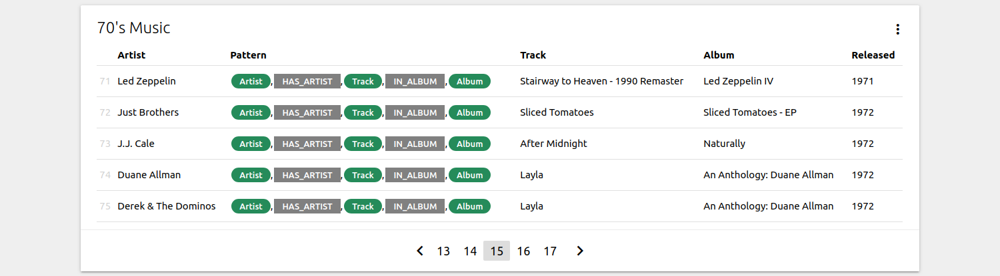
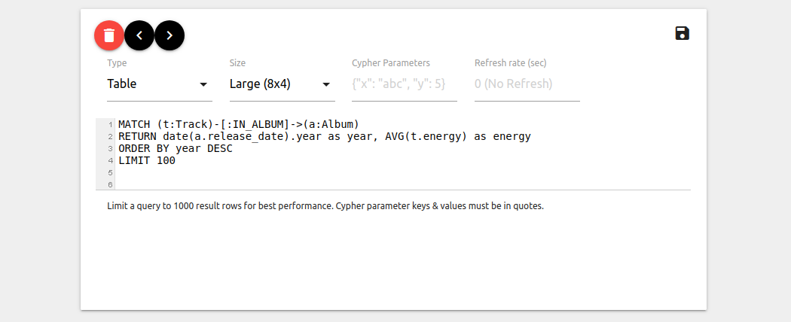

# NeoDash - Neo4j Dashboard Builder
## 1 Introduction 
NeoDash is a lightweight web-based tool to create Neo4j dashboards. 
Writing Cypher is all that's required to build your first dashboard in minutes.

Want to give NeoDash a spin right away? Try it here:  https://nielsdejong.nl/neodash/.

### 1.1 Features
- Live reporting on a Neo4j database with a table, graph view, bar chart or line chart.
- Support for reporting on Neo4j data types, including nodes, edges, paths, as well as aggregate types.
- Setting auto-refresh intervals for each report.
- Customizing your dashboard layout with a variety of report sizes.
- Saving/loading dashboards as a JSON file.


## 2. Documentation & User Guide
### 2.1 Reports
NeoDash dashboards are a collection of reports - each report is a view of your graph.
The current version of NeoDash supports six types of reports:
                                                                                       
- Table views
- Graph visualizations
- Bar charts
- Line charts
- JSON output
- Markdown Reports

 Reports sit in resizable containers -  _cards_.
A report is always populated by a single Cypher query. An example table report is shown below:

 

The following rule of thumb holds for reports:
- one report = one card = one Cypher query 

#### 2.1.1 Report Settings
Each report has a settings screen that can be accessed by clicking the (⋮) icon on the top right of the card. 
In the settings menu, the following can be defined:
- The Cypher query populating the report, 
- The type of report,
- The size of the report,
- [Parameters](https://neo4j.com/docs/cypher-manual/current/syntax/parameters/) for your Cypher query,
- A refresh interval for the report.

> A title of a report can be edited directly, without opening the settings. Just click the header of the report (which by default reads 'Report name...').

An example report settings view is shown below.

 

While having the report settings open, the report can be moved around or deleted. To close the settings, click the 'save' icon.
#### 2.1.2 Tables
The table view renders Neo4j native types in a standard table format. Columns are ordered in the order they are returned by Neo4j, column names are set to the names of your returned variables. [Structural data types](https://neo4j.com/docs/cypher-manual/current/syntax/values/#structural-types) such as nodes, relationships or paths can also be rendered in a table.

The colors of the nodes and relationships in the table can be set using the Cypher Parameters settings. For example, specifying:
```
{
    "nodeColor": "orange",
    "relColor": "black"
}
```
will draw the nodes in the table as orange, and the relationships as black.

#### 2.1.3 Graph Visualizations
For almost all graph use-cases, a force-directed graph is your go-to choice of visualization. In NeoDash, you’ll be able to visualize your graph similar to the Neo4j browser: for each node label you choose a style and the property to be displayed. Any query returning nodes, relationships, or paths can be visualized as a graph. 
> Doing some graph exploration? Clicking a node will show all properties of that node.

Some style properties of the visualization can be changed by passing in extra parameters to your Cypher query. To use custom colors for the graph nodes, add the following to the Cypher Parameters in the settings:
```
{
    "nodeColors": ["navy","green","red"]
}
```

#### 2.1.4 Bar Charts
Bar charts can be used to visualize categorical data. Naturally, a bar chart will need a numeric value to plot on the y-axis. The properties to visualize can be dynamically select based on the returned values of your Cypher query.


The color of a bar chart can be customized by setting the following value in the Cypher Parameters:
```
{
    "color": "red"
}
```
#### 2.1.5 Line Charts
Line charts can be used to visualize the relationship between two numeric variables. Just like the bar chart, you’ll select two of the result properties to be plotted on the x and y axis.

The `Cypher Parameters` setting can be used to customize several style properties of your line chart. Add the following parameters, to create a red curved line chart, with a line width of 4 and a marker radius of 4:
```
{
    "curve": true,
    "radius": 4, 
    "color": "red", 
    "width": 4
}
```

#### 2.1.6 JSON View
The JSON view report will render the raw JSON response received by the Neo4j driver.
JSON output reports are mainly intended as a debugging tool, if you need to inspect the direct data retrieved from Neo4j.

#### 2.1.7 Markdown
Markdown reports can be used to render static text and images in your reports.
You'll likely use this type of reports to add some comments/interpretations of your reports for the user to see.

Unlike all other report types, markdown reports do not use Cypher input.
Instead, the text/images you want to show need to be specified in the markdown format. This [page](https://www.markdownguide.org/basic-syntax/) contains a nice overview of the required syntax.

 
### 2.2 Dashboard Layout
The web-app uses a free-flowing grid to organize your reports as cards. This grid layout has a page width of 12, and a standard card size of 4.
Cards can be resized and moved around if needed. 
On mobile displays, small cards will scale to the full width of the screen.

Differently sized cards will sit together and try to take up available space in the dashboard. The image below illustrates how cards may sit together.


 

The Materialize CSS framework is used to render the cards in a grid layout. For more information on grid layouts in Materialize, check out this link:
https://materializecss.com/grid.html

> The title of the dashboard can be edited by clicking the page header. 

### 2.3 Saving/Loading Reports
By default, your latest dashboard is cached in the browser.

NeoDash al supports exporting and importing dashboards as a plain JSON file. 
This allows you to store / version control dashboards with a project if needed.
 
#### 2.3.1 Saving
Reports can be exported as JSON by clicking the 'Load/Export' button at the top right of the screen.

#### 2.3.2 Loading
To load an existing dashboard, click the 'Load/Export' button at the top right of the screen. Clear the existing JSON, and paste your loaded dashboard into the box. 
Click the green 'Save' button to proceed.

#### 2.3.3 Working with dashboard JSON files
Each dashboard JSON file will have the following structure:
```
{
  "title": "My Dashboard",
  "version": "1.0",
  "editable": true,
  "reports": [
        ...
  ]
}
```
Here, the value of reports will contain an array of JSON objects, where each object represents a report.
Save files shouldn't be manipulated directly (unless you know what you're doing).


> Tip: by setting "editable" to false, your dashboard will be rendered in 'view only' mode, restricting users from changing report titles / editing the settings. 

### 2.4 Further examples
Check out the NeoDash release blog post here:
https://nielsdejong.nl/neo4j%20projects/2020/11/16/neodash.html

## 3. Developer Guide
NeoDash is built with React, and uses the `npm` package manager.
When running NeoDash, ensure that the `PUBLIC_URL` environment variable is set to where you are hosting the application.
Dependencies are specified in `package.json`.

> NeoDash is not intended to be used in a production setting by one or more users. [Get in touch](mailto:niels.dejong@neo4j.com) if you need help building a production-grade Neo4j front-end.
### 3.1 Install
NeoDash can be installed using npm:

`cd ui && npm install`

### 3.2 Run in development mode
Running the application in development mode:

`cd ui && npm start`

### 3.3 Build
Building the application:

`cd ui && npm build`