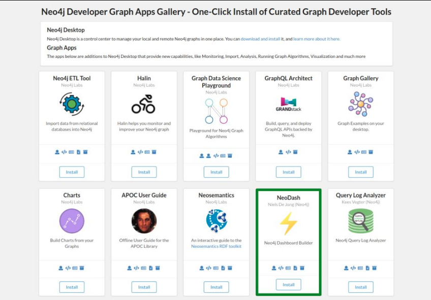
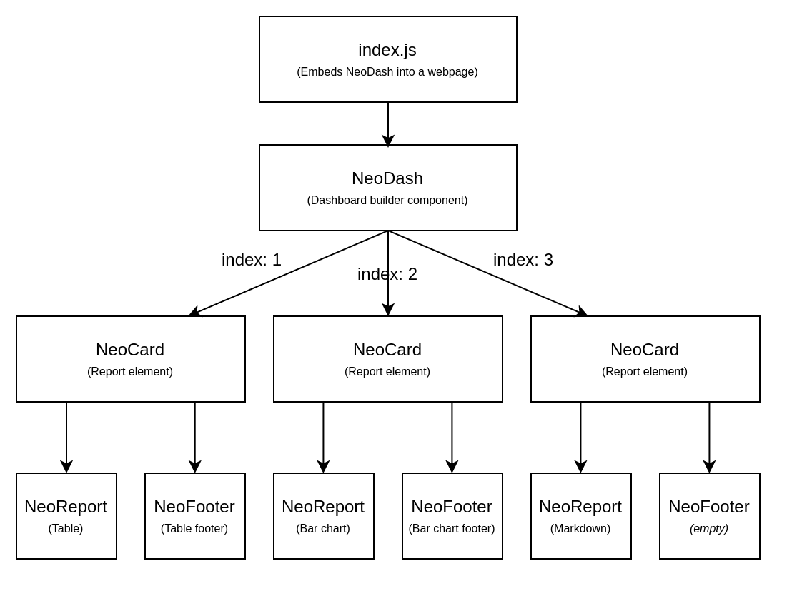

# NeoDash Developer Guide
> This guide is a work in progress. it is still under active development. If you have any questions, reach out to niels.dejong@neo4j.com.

This document contains information on the following topics:
- Running NeoDash
- Extending NeoDash
- Contributing


## Running NeoDash
> If you let end-users access NeoDash, make sure you let them use a read-only account. 
> Be aware that users can run any Cypher query, so only give access to users you trust.
 
There are three options for running NeoDash:
- As a graph app (From Neo4j Desktop)
- As a publicly accessible website
- As a web-app in your own hosted environment
 
#### 1. From Neo4j Desktop
If you're using Neo4j Desktop, you can install NeoDash from the [Graph App Gallery](when).
NeoDash will automatically connect to your active database.

 
#### 2. Online
The latest version of NeoDash will always be available at https://nielsdejong.nl/neodash.
Your database credentials will only be cached in your browser.   

#### 3. As a web app in your own hosted environment
To build the application for running in your own environment, take the following steps:

- clone or download this repository.
- [Install](https://www.npmjs.com/get-npm) `npm`.
- navigate to the directory of the repository.
- run `npm install` to install dependencies.
- run `npm run-script build` to build the application. The web app will be deployed to the `dist` folder.
- Use your favourite web server (`apache` or `nginx`) to host the `dist` folder.

> Ensure that the `PUBLIC_URL` environment variable is set to where you are hosting the application. This needs to be specified before building in the `.env` file.


## Extending NeoDash
NeoDash can be extended to support other visualizations and report types. 
This section will provide some instructions on how to extend the application to fit your needs.

### Class Hierarchy
The image below expresses the high level structure of the application's components. 
 

- `index.js` is a basic webpage embedding NeoDash.
- `NeoDash.js` is the dashboard builder class. It contains references to each of the dashboard elements (**cards**), as well as methods to create/re-order the cards. `NeoDash.js` also handles setting up the Neo4j connection and storing/loading reports.  
- `NeoCard.js` is a single report element. A `NeoCard` always has a single `NeoReport` (the visualization/report) and a single `NeoFooter` (table pagination, other buttons). The settings pop-up for a dashboard element is defined in `NeoSettings.js`. `NeoCard.js` handles generic operators for all dashboard elements (resizing, refreshing, ...) 
- `NeoReport.js` is an base class that different visualizations/reports can inherit. It handles running Cypher queries and generating a result object for the reports to visualize.
- `NeoFooter.js` is the small strip that sits under a `NeoReport`. It handles simple configuration edits for the reports (e.g. choosing which variables to render).

The `component` folder contains reusable components (buttons, textboxes, etc.) that can be used by any of the elements in the class hierarchy.

### Adding a new report type
To add your own report type to NeoDash, follow the following steps:

#### 1. Clone and run the application in development mode
NeoDash is built with React, and uses the `npm` package manager. Dependencies are specified in `package.json`.
After cloning, navigate to the main folder and install NeoDash using npm:
- `npm install`

Then, run the application in development mode:
- `npm start`


#### 2. Adding the new report type
Create a new javascript file in the `card/report` folder. Add the following skeleton code:
```
import React from "react";
import NeoReport from "./NeoReport";

class NeoTestReport extends NeoReport {
    constructor(props) {
        super(props);
    }

    render() {
        let rendered = super.render();
        if (rendered) {
            return rendered;
        }
        return <p>{JSON.stringify(this.state.data)}</p>;
    }
}

export default (NeoTestReport);
```

This basic report will render your results as a basic text paragraph. Next, also add a new footer class to a file in the `card/footer` directory:
```
import React from "react";
import NeoFooter from "./NeoFooter";

class NeoTestFooter extends NeoFooter {
    constructor(props) {
        super(props);
    }
    
    render() {
        return (<p>I'm a footer</p>);
    }
}

export default (NeoTestFooter);
```

#### 3. Making the new type selectable
Next, you'll want to make your new report & footer selectable.

In `NeoCard.js`, import your new classes `NeoTestReport` and `NeoTestFooter`, then add the following new method:
```
    setCardTypeToTest() {
        this.state.content =
            <NeoTestReport
                connection={this.props.connection} 
                query={this.state.query}
                params={this.state.parsedParameters}
                data={this.state.data}
                stateChanged={this.stateChanged}
                refresh={this.state.refresh}/>
        this.state.action = <NeoTestFooter data={this.state.data} />;
    }
```

Then, in the same file, edit `updateReportComponent(state)` and add the following if-statement:
```
if (this.state.type === 'test') {
    this.setCardTypeToTest();
}
```

Finally, we need to add 'test' to be a selectable option in the report settings view.
In `NeoCardSettings.js`, add the following entry to the `vizOptions` dictionary:
```
'test': 'Test'
```

Now, you can run your application in development mode and the new report type will be selectable in the card settings.
For more advanced examples, like handling updates from the footer, see the other implemented reports.

#### 4. Build the application
After you're done with development, build your application:
- `npm run-script build`

## Contributing
If you're extending NeoDash, please consider contributing to the repository by creating a [pull request](https://github.com/nielsdejong/neodash/pulls).
